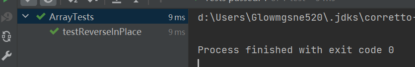

Lab_report3

# Part 1- bugs
## 1. with failure
code:


```java

  public void testReversed() {
    int[] input1 = { };
    assertArrayEquals(new int[]{ }, ArrayExamples.reversed(input1));
  }
      
```
result:
```java
d:\Users\Glowmgsne520\.jdks\corretto-11.0.16.1\bin\java.exe -ea -Didea.test.cyclic.buffer.size=1048576 "-javaagent:D:\IntelliJ IDEA Community Edition 2022.2.2\lib\idea_rt.jar=55192:D:\IntelliJ IDEA Community Edition 2022.2.2\bin" -Dfile.encoding=UTF-8 -classpath "D:\IntelliJ IDEA Community Edition 2022.2.2\lib\idea_rt.jar;D:\IntelliJ IDEA Community Edition 2022.2.2\plugins\junit\lib\junit5-rt.jar;D:\IntelliJ IDEA Community Edition 2022.2.2\plugins\junit\lib\junit-rt.jar;D:\learn_java\ass_cse15l\week4\lab3\out\production\lab3;D:\learn_java\ass_cse15l\week4\lab3\lib\junit-4.13.2.jar;D:\learn_java\ass_cse15l\week4\lab3\lib\hamcrest-core-1.3.jar" com.intellij.rt.junit.JUnitStarter -ideVersion5 -junit4 ArrayTests,testReverseInPlace

arrays first differed at element [3]; 
Expected :1
Actual   :-5
<Click to see difference>


	at org.junit.internal.ComparisonCriteria.arrayEquals(ComparisonCriteria.java:78)
	at org.junit.internal.ComparisonCriteria.arrayEquals(ComparisonCriteria.java:28)
	at org.junit.Assert.internalArrayEquals(Assert.java:534)
	at org.junit.Assert.assertArrayEquals(Assert.java:418)


```

## 2. without failure
code:
```java
@Test 
	public void testReverseInPlace() {
    int[] input1 = { 3 };
    ArrayExamples.reverseInPlace(input1);
    assertArrayEquals(new int[]{3 }, input1);
	}
```
result:


## 3. what's problem
before:
```java
static void reverseInPlace(int[] arr) {
    for(int i = 0; i < arr.length; i += 1) {
      arr[i] = arr[arr.length - i - 1];
    }
    }
```
after fixing the bug:
```java
 static void reverseInPlace(int[] arr) {
  
    int front = 0;
    int back = arr.length - 1;
    while (front < back) {
      // swap
      int cur = arr[front];
      arr[front] = arr[back];
      arr[back] = cur;

      front++;
      back --;
    }
  }
```
describe: Originally, the code will use backwards value to overwrite forwards value. But we should **swap instead of "overwrite"**.

# Part2, about find command
## 1. find by name

Use full file name
```java
[user@sahara ~]$ find . -name Server.java
./wavelet/Server.java
```
Use file name with *
```java
[user@sahara ~]$ find . -name Server.*
./wavelet/Server.class
./wavelet/Server.java
```

## 2.  find by type
find files, combined with name 
```
[user@sahara ~]$ find . -type f -name Server.*
./wavelet/Server.class
./wavelet/Server.java
```

find directory.
```
[user@sahara ~]$ find . -type d  -name hooks
./wavelet/.git/hooks
```
## 3. find by time
find big files
```
[user@sahara ~]$ find .  -size  +4k
./wavelet/.git/hooks/fsmonitor-watchman.sample
./wavelet/.git/hooks/pre-rebase.sample
```
find small files
```
[user@sahara ~]$ find .  -size  -2
./.ssh/id_ed25519.pub
./.ssh/known_hosts
./.ssh/id_ed25519
./.lesshst
./wavelet/URLHandler.class
./wavelet/README.md
```
## 4. exec to further find results
exec to close executable permission.
```
[user@sahara ~]$ find .  -type f -name *.java  -exec chmod a
-x {} \;
[user@sahara ~]$ ls -l wavelet/
total 36
-rw-r--r-- 1 user user 1152 Nov 25 12:23 Handler.class
-rw-r--r-- 1 user user  723 Nov 25 12:23 NumberServer.class
-rw-rw-rw- 1 user user 1294 Nov 25 12:23 NumberServer.java
-rw-r--r-- 1 user user  242 Nov 25 12:23 README.md
-rw-r--r-- 1 user user  873 Nov 25 12:23 Server.class
-rw-r--r-- 1 user user 1072 Nov 25 12:23 ServerHttpHandler.c
lass
-rw-rw-rw- 1 user user 1825 Nov 25 12:23 Server.java
-rw-rw-rw- 1 user user 2020 Nov 25 12:23 StringServer.java
-rw-r--r-- 1 user user  158 Nov 25 12:23 URLHandler.class
```
exec to add executable permission.
```
[user@sahara ~]$ find .  -type f -name *.java  -exec chmod a
+x {} \;
[user@sahara ~]$ ls -l wavelet/
total 36
-rw-r--r-- 1 user user 1152 Nov 25 12:23 Handler.class
-rw-r--r-- 1 user user  723 Nov 25 12:23 NumberServer.class
-rwxrwxrwx 1 user user 1294 Nov 25 12:23 NumberServer.java
-rw-r--r-- 1 user user  242 Nov 25 12:23 README.md
-rw-r--r-- 1 user user  873 Nov 25 12:23 Server.class
-rw-r--r-- 1 user user 1072 Nov 25 12:23 ServerHttpHandler.c
lass
-rwxrwxrwx 1 user user 1825 Nov 25 12:23 Server.java
-rwxrwxrwx 1 user user 2020 Nov 25 12:23 StringServer.java
-rw-r--r-- 1 user user  158 Nov 25 12:23 URLHandler.class
```

## cite
cite:https://www.runoob.com/linux/linux-comm-find.html

