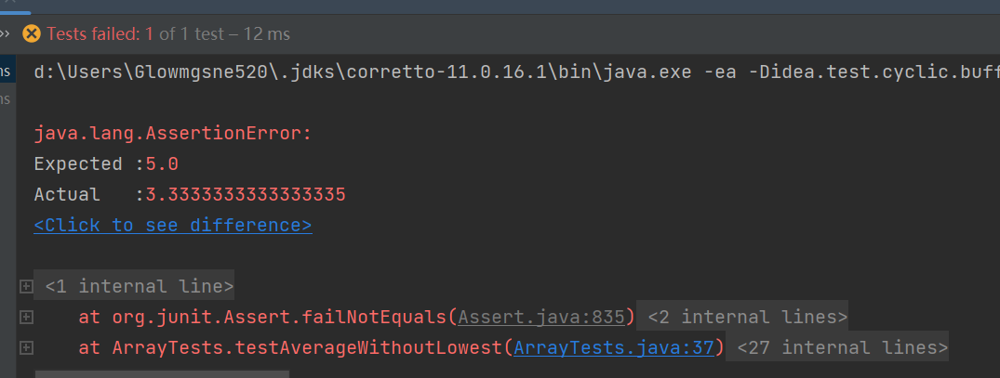
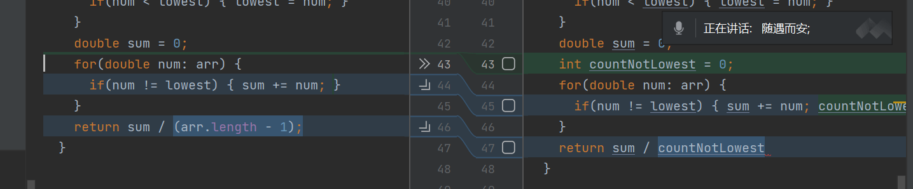

# 1. test reverseInPlace method


fix bug for this method:


# 2. test AverageWithoutLowest method
find error:

```aidl
 public void testAverageWithoutLowest() {
        double[] arr = {2, 4, 6, 8};
        double actual = ArrayExamples.averageWithoutLowest(arr);
        assertEquals(6, actual, 0.000001);


        double[] arr2 = {2};
        actual = ArrayExamples.averageWithoutLowest(arr2);
        assertEquals(0, actual, 0.000001);

        double[] arr3 = {2, 4, 6, 8, 0, 0, 0, -80000, -2, -4, -6, -8};
        actual = ArrayExamples.averageWithoutLowest(arr3);
        assertEquals(0, actual, 0.000001);

        double[] arr4 = {2, 2, 4, 6};
        actual = ArrayExamples.averageWithoutLowest(arr4);
        assertEquals(5, actual, 0.000001);

    }
}
```



fix bug:


